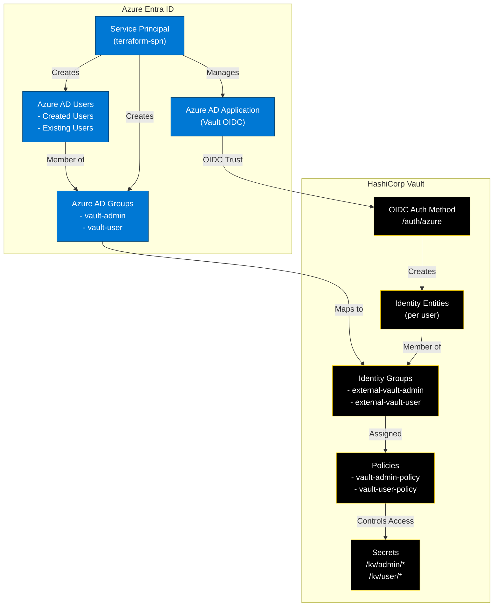
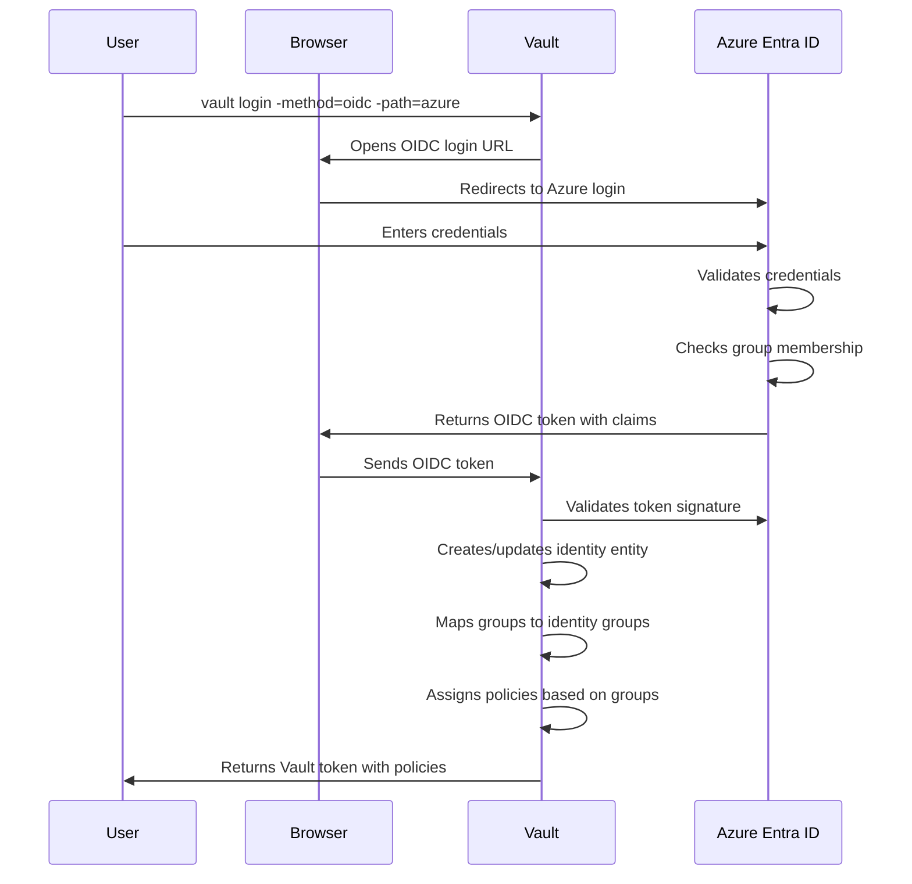

# Azure Entra ID Lab

This lab demonstrates how to integrate HashiCorp Vault with Azure Entra ID (formerly Azure AD) for identity and access management. The lab sets up OIDC authentication between Vault and Azure, allowing Azure users and groups to authenticate to Vault.

## Prerequisites

- Azure subscription with Global Administrator role
- Docker and Azure CLI access
- Vault Enterprise running with TLS enabled
- Terraform CLI

## Launch Azure CLI Container

```bash
# Mount current directory and Azure credentials
docker run -it --rm \
  -v $(pwd):/workspace \
  -v $(pwd)/.azure:/root/.azure \
  -w /workspace \
  mcr.microsoft.com/azure-cli:latest \
  /bin/bash
```

## Azure Entra ID Configuration

1. Login to Azure:
   ```bash
   az login
   ```

2. Set subscription ID:
   ```bash
   export SUBSCRIPTION_ID=$(az account show --query id -o tsv)
   ```

3. Create a service principal with required permissions:
   ```bash
   # Create service principal with Contributor role for Azure resources
   az ad sp create-for-rbac --name terraform-spn \
     --role Contributor \
     --scopes /subscriptions/$SUBSCRIPTION_ID
   
   # Get the APP_ID from the output above, then grant Azure AD permissions
   export APP_ID="<appId-from-previous-command>"
   
   # Grant Azure AD permissions for managing applications, users, and groups
   # Note: These require admin consent in your organization
   
   # Application management permissions
   az ad app permission add --id $APP_ID \
     --api 00000003-0000-0000-c000-000000000000 \
     --api-permissions 1bfefb4e-e0b5-418b-a88f-73c46d2cc8e9=Role
   
   # User management permissions
   az ad app permission add --id $APP_ID \
     --api 00000003-0000-0000-c000-000000000000 \
     --api-permissions 741f803b-c850-494e-b5df-cde7c675a1ca=Role
   
   # Group management permissions
   az ad app permission add --id $APP_ID \
     --api 00000003-0000-0000-c000-000000000000 \
     --api-permissions 62a82d76-70ea-41e2-9197-370581804d09=Role
   
   # Directory read permissions
   az ad app permission add --id $APP_ID \
     --api 00000003-0000-0000-c000-000000000000 \
     --api-permissions 7ab1d382-f21e-4acd-a863-ba3e13f7da61=Role
   
   # App role assignment permissions
   az ad app permission add --id $APP_ID \
     --api 00000003-0000-0000-c000-000000000000 \
     --api-permissions 06b708a9-e830-4db3-a914-8e69da51d44f=Role
   
   # Grant admin consent (requires Global Administrator role)
   az ad app permission admin-consent --id $APP_ID
   
   # Alternative: Grant consent for the Vault application specifically
   # First get the Vault app ID from Terraform output
   export VAULT_APP_ID=$(terraform output -raw vault_application_id)
   az ad app permission admin-consent --id $VAULT_APP_ID
   ```
   
   **Required Azure AD API Permissions:**
   - `Application.ReadWrite.All` (1bfefb4e-e0b5-418b-a88f-73c46d2cc8e9) - Create and manage Azure AD applications
   - `User.ReadWrite.All` (741f803b-c850-494e-b5df-cde7c675a1ca) - Create and manage users
   - `Group.ReadWrite.All` (62a82d76-70ea-41e2-9197-370581804d09) - Create and manage groups
   - `Directory.Read.All` (7ab1d382-f21e-4acd-a863-ba3e13f7da61) - Read directory data
   - `AppRoleAssignment.ReadWrite.All` (06b708a9-e830-4db3-a914-8e69da51d44f) - Assign app roles to users and groups

   This command will output JSON containing the credentials. Save these values:
   ```json
   {
     "appId": "your-client-id",
     "displayName": "terraform-spn",
     "password": "your-client-secret",
     "tenant": "your-tenant-id"
   }
   ```

4. Set environment variables using the output from step 3:
   ```bash
   export ARM_SUBSCRIPTION_ID="$SUBSCRIPTION_ID"
   export ARM_TENANT_ID="<tenant-value-from-json>"
   export ARM_CLIENT_ID="<appId-value-from-json>"
   export ARM_CLIENT_SECRET="<password-value-from-json>"
   ```

5. Source the variables:
   ```bash
   source .env
   ```

## Terraform Configuration

### Running the Lab

1. Initialize Terraform:
   ```bash
   terraform init
   ```

2. Copy `terraform.tfvars.example` to `terraform.tfvars` and customize.

3. Plan and apply:
   ```bash
   terraform plan
   terraform apply
   ```

### Configuration Details

**Key Features:**
- Creates Azure AD groups and users as defined in `terraform.tfvars`
- Configures a Vault application with OIDC authentication
- Maps Azure AD groups to Vault policies
- Supports both newly created users and existing Azure AD users
- Uses data sources to reference existing Azure AD users by UPN
- Automatically adds existing users to the vault-user group

**Variables:**
- `azure_groups`: Map of Azure AD groups to create
- `azure_users`: Map of new Azure AD users with group memberships
- `existing_users`: List of existing Azure AD user principal names to add to vault-user group
- `vault_addr`: Vault server address (default: https://127.0.0.1:8200)

## Lab Architecture

The Terraform configuration creates a complete Vault-Azure integration:



### Authentication Flow




### File Structure
- `main.tf`: Azure AD application registration and Vault OIDC configuration
- `identity.tf`: Vault identity entities and groups for Azure users
- `policies.tf`: Vault policies for Azure group access control
- `secrets.tf`: Sample KV secrets for testing access
- `vault.tf`: Vault provider configuration with TLS
- `variables.tf`: Input variable definitions
- `outputs.tf`: Resource IDs and connection information

### Key Components
1. **Azure AD Application**: Registered application for OIDC authentication
2. **Vault OIDC Auth Method**: Configured to trust Azure tokens
3. **Identity Mapping**: Azure groups mapped to Vault policies
4. **Access Control**: Role-based access using Azure group memberships

### Technical Implementation
- Uses `data "azuread_user"` to reference existing Azure AD users
- Combines created and existing user memberships using `concat()` function
- Supports flexible group membership assignment through variables
- Implements proper TLS configuration for secure OIDC communication

## Testing the Integration

After successful deployment:

1. **Get the Vault Application ID for admin consent:**
   ```bash
   terraform output vault_application_id
   ```

2. **Grant admin consent (if not done earlier):**
   ```bash
   export VAULT_APP_ID=$(terraform output -raw vault_application_id)
   az ad app permission admin-consent --id $VAULT_APP_ID
   ```

3. **Test OIDC authentication:**

   **Root namespace (vault-admin group):**
   ```bash
   # Login with Azure credentials via browser
   vault login -method=oidc -path=azure
   ```

   **Admin namespace (vault-user group):**
   ```bash
   # Login with Azure credentials via browser in admin namespace
   vault login -method=oidc -path=azure -namespace=admin
   ```

## Troubleshooting

### Useful Commands

```bash
# Check OIDC configuration
vault auth list -detailed

# Test group membership
vault token lookup
```